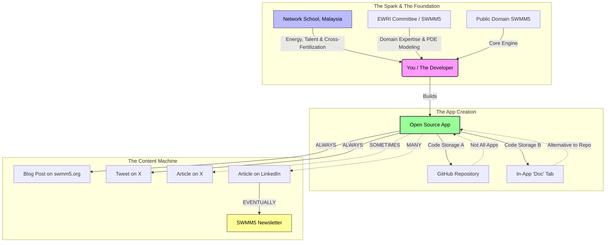

# Hi 👋, I'm Robert Dickinson

### Hydraulic Modeling Pioneer | SWMM5+ Expert | Ruby Automation | Vibe Coding Apps

---

- 🌊 **50+ years** of EPA SWMM experience — from punch cards to modern processors
- 🏛️ **SWMM5+ Technical Advisory Committee Chair** at [CIMM.org](https://cimm.org)
- 🌐 Creator of [**SWMM5.org**](https://swmm5.org) — 1,700+ blog posts, 91+ interactive apps, 133+ Ruby scripts
- 🎨 Building **"The Dickinson Canon"** — interactive p5.js tools transforming static engineering into dynamic learning
- 🔄 Specializing in **InfoSewer → ICM InfoWorks** conversions (ArcMap deadline: March 2026)
- 📊 Deep expertise in **RDII analysis** and RTK methodology since 1996

---

### 🛠️ What I Work With

`EPA SWMM` `ICM InfoWorks` `InfoSWMM` `InfoSewer` `XPSWMM` `Ruby` `Python` `p5.js` `JavaScript`

---

### 🚀 Current Projects

| Project | Description |
|---------|-------------|
| **SWMM5 Vibe Coding Apps** | Interactive educational tools for stormwater modeling |
| **Infiltration Explorer** | Visual p5.js module for infiltration parameters |
| **RTK Unit Hydrograph Tools** | RDII analysis and visualization |
| **Manning's Equation Visualizer** | Hands-on hydraulic calculations |
| **ICM Ruby Automation** | Network cleanup, RDII utilities, model conversion scripts |

---

### 💬 Ask Me About

`SWMM` `RDII Analysis` `RTK Methodology` `Hydraulic Modeling` `InfoSewer to ICM Conversion` `Ruby Scripting for ICM` `Stormwater Management` `Unit Hydrographs`

---

### 🔗 Connect With Me

---

### 📈 GitHub Stats

GitHub Stats: 
Top Languages: 
Streak Stats: 

---

### 📫 Reach Out

Have questions about hydraulic modeling, SWMM, or need help with an InfoSewer migration? I'm always happy to discuss!

### My Workflow for Apps about SWMM and ICM n/t @ns or Network School

This is a fascinating ecosystem because it combines deep domain expertise (50+ years of SWMM) with modern, high-energy "cross-fertilization" from the tech world (Network School).

Here is a diagram representing your specific **"Open Source SWMM5 App Ecosystem."**

### The Ecosystem Diagram

This flow visualizes how your inspiration transforms into code and how that code is distributed across your specific channels.

### Infographic Concept: "The SWMM5 Innovation Cycle"

If you want to turn this into a polished visual for your newsletter or a presentation, here is how to structure the layout:

#### **Title:** The SWMM5 Open Source Cycle

**Subtitle:** Bridging Deep Hydraulic Modeling with Modern Tech Innovation

---

#### **Panel 1: The Inputs (Cross-Fertilization)**

* **Visual:** A split brain or a handshake.
* **Left Side (Experience):** Icons of water/pipes and a gavel (Committee).
* *Text:* "Deep Domain Knowledge: EWRI Committee, PDE Modeling, SWMM5/ICM."

* **Right Side (Energy):** A lightning bolt or vibrant network nodes.
* *Text:* "Fresh Inspiration: Network School (Malaysia). High-energy coding talent & outside-the-box thinking."

#### **Panel 2: The Code (Open & Accessible)**

* **Visual:** An App Window icon.
* **Central Rule:** "All Apps are Open Source & Public Domain Focused."
* **The Fork in the Road:**
* *Path A:* **Heavy Duty:** Full GitHub Repository.
* *Path B:* **Lightweight:** Source code embedded directly in the App's "Doc" tab.

#### **Panel 3: The Broadcast (The Content Engine)**

* **Visual:** A megaphone or signal tower.
* **The "Always" Layer:**
* ✅ Blog Post (swmm5.org)
* ✅ Tweet (X)

* **The "Deep Dive" Layer:**
* 📝 LinkedIn Articles (Technical breakdowns)
* 📝 X Articles (Long-form thoughts)

* **The "Legacy" Layer:**
* 📰 The Newsletter (The final curation of the best work).

### Why this framing works

It highlights your unique value proposition: You aren't just an engineer, and you aren't just a coder. You are a bridge. You take the **inspiration** from the youth/tech sector in Malaysia and apply it to the **hard engineering** of the SWMM5 world, resulting in tools that are shared openly.
